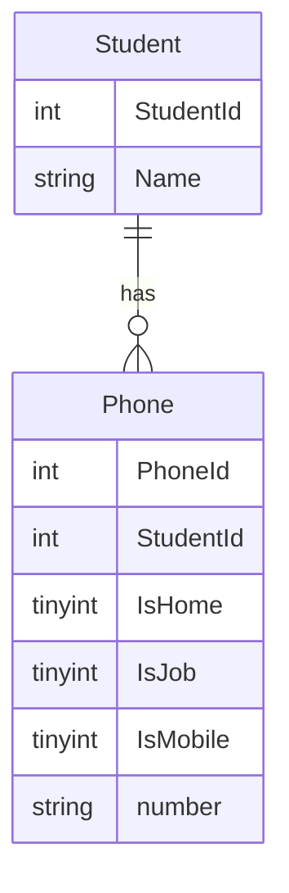

# edu-intro-mysql

> Vi normaliserar Phones. Phones är en relation i en tabellen och bryter mot första normalform. Vi går dock ett steg längre och normaliseriar även telefontyp. Den förtjänar dock en hel del diskussion. Kan en telefon vara både mobil och jobbtelefon? Ska det vara attribut eller relationer?

> En student, har noll eller flera telefoner.
> 



## Instruktioner

### I bash

```bash
cd ~
cd ws
cd sql # Använd gärna din klonade repo som du använder för inlämning istället.
touch normalization.sql

# När vi är klara med normalization.sql, använder vi exec för att kora den som iths användare.
docker exec -i container-with-mysql mysql -uiths -piths < normalization.sql
```

### Alternativ 1, Relationer

#### Redigera normalization.sql
```sql
USE iths;


DROP TABLE IF EXISTS PhoneType;
CREATE TABLE PhoneType (
    PhoneTypeId INT NOT NULL AUTO_INCREMENT,
    Type VARCHAR(32),
    CONSTRAINT PRIMARY KEY(PhoneTypeId)
);
INSERT INTO PhoneType(Type) VALUES("Home");
INSERT INTO PhoneType(Type) VALUES("Job");
INSERT INTO PhoneType(Type) VALUES("Mobile");

DROP TABLE IF EXISTS Phone;
CREATE TABLE Phone (
    PhoneId INT NOT NULL AUTO_INCREMENT,
    StudentId INT NOT NULL,
    PhoneTypeId INT NOT NULL,
    Number VARCHAR(255) NOT NULL,
    CONSTRAINT PRIMARY KEY(PhoneId)
);

INSERT INTO Phone(StudentId, PhoneTypeId, Number) 
SELECT ID, PhoneTypeId, HomePhone FROM UNF JOIN PhoneType ON Type = "Home"
WHERE HomePhone IS NOT NULL AND HomePhone != ''
UNION SELECT ID, PhoneTypeId, JobPhone FROM UNF JOIN PhoneType ON Type = "Job"
WHERE JobPhone IS NOT NULL AND JobPhone != ''
UNION SELECT ID, PhoneTypeId, MobilePhone1 FROM UNF JOIN PhoneType ON Type = "Mobile"
WHERE MobilePhone1 IS NOT NULL AND MobilePhone1 != ''
UNION SELECT ID, PhoneTypeId, MobilePhone2 FROM UNF JOIN PhoneType ON Type = "Mobile"
WHERE MobilePhone2 IS NOT NULL AND MobilePhone2 != '';


DROP VIEW IF EXISTS PhoneList;
CREATE VIEW PhoneList AS SELECT StudentId, group_concat(Number) AS Numbers FROM Phone GROUP BY StudentId;

/* Alternativt */
CREATE VIEW PhoneList AS SELECT StudentId, group_concat(concat("(", Type, ") ", Number)) AS Numbers FROM Phone JOIN PhoneType USING (PhoneTypeId) GROUP BY StudentId;

SELECT Numbers from Student JOIN PhoneList USING (StudentId);
```

### Alternativ 2, Attribut

```sql
DROP TABLE IF EXISTS Phone;
CREATE TABLE Phone (
    PhoneId INT NOT NULL AUTO_INCREMENT,
    StudentId INT NOT NULL,
    IsHome TINYINT NOT NULL  default 0,
    IsJob TINYINT NOT NULL  default 0,
    IsMobile TINYINT NOT NULL  default 0,
    Number VARCHAR(255) NOT NULL,
    CONSTRAINT PRIMARY KEY(PhoneId)
);

INSERT INTO Phone(StudentId, IsHome, IsJob, IsMobile, Number) 
SELECT ID, TRUE, FALSE, FALSE, HomePhone FROM UNF
WHERE HomePhone IS NOT NULL AND HomePhone != ''
UNION SELECT ID, FALSE, TRUE, FALSE, JobPhone FROM UNF
WHERE JobPhone IS NOT NULL AND JobPhone != ''
UNION SELECT ID, FALSE, FALSE, TRUE, MobilePhone1 FROM UNF
WHERE MobilePhone1 IS NOT NULL AND MobilePhone1 != ''
UNION SELECT ID, FALSE, FALSE, TRUE, MobilePhone2 FROM UNF
WHERE MobilePhone2 IS NOT NULL AND MobilePhone2 != '';

DROP VIEW IF EXISTS PhoneList;
CREATE VIEW PhoneList AS SELECT StudentId, group_concat(Number) AS Numbers FROM Phone GROUP BY StudentId;
```
## Normalisering

> Normalisering innebär att man tar bort anomalier. En anomali är en "konstighet", eller ett felaktigt beteende för databasen. 
> Dessa är hot mot C från ACID (Consistency), dvs motsatsen till korrupt. Så vi skyddar vår data genom att ge den bättre förutsättningar att vara konsistent över åren, genom att ta bort anomalier i databasen. 
> 
> När anomalier är helt borta, är även redundant data borta.
> Vi siktar på tredje Normal Form ([3NF](https://en.wikipedia.org/wiki/Third_normal_form)). Ofta anser man att Boyce-Codd [BCNF](https://en.wikipedia.org/wiki/Boyce%E2%80%93Codd_normal_form) räcker för att en databas ska vara tillräckligt normaliserad. 

### [1NF]()

> En relation är i första normal form, om och endst om, ingen attribut har relationer som element. Exempelvis Hobbies, Telefonnummer, Skola är exempel på relationer som finns i UNF tabellen.

### [2NF](https://en.wikipedia.org/wiki/Second_normal_form)

> Förklaras bättre på level-5.

### [3NF](https://en.wikipedia.org/wiki/Third_normal_form)

> Varje värde i databasen skall vara beroende enbart av primärnyckeln.

### [4NF](https://en.wikipedia.org/wiki/Fourth_normal_form)

### [5NF](https://en.wikipedia.org/wiki/Fifth_normal_form)

### [BCNF/3.5NF](https://en.wikipedia.org/wiki/Boyce%E2%80%93Codd_normal_form)

> Ett tillägg, då Boyce och Codd insåg att 3NF inte tog bort alla anomalier, så de skapade 3.5NF.

> **_NOTE:_**  BCNF är den normalform som oftast är mål vid databas design.
