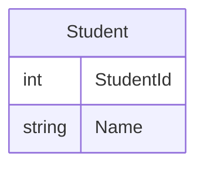

# edu-intro-mysql

## Beskrivning

> Vi normaliserar student. Vi kombinerar DQL och DDL för att kunna få fatt på rätt data och skapa nödvändiga tabeller.
> Vi använder oss av INSERT INTO, för att fylla tabellen.



> **_NOTE:_**  Läs mer om normalisering i slutet.

## Instruktioner

### I container-with-mysql

### Analys - Hitta dubletter

> Ofta i analysen försöker vi lista ut så mycket vi kan om datat. Det vi ser är att skola är vad som skapar dubletter. Samma person går i två skolor och blir därför två rader. Sedan ser vi att stad samvarierar med skola, och vi kan anta att stad är ett attribut till Skola och eventuellt ingen egen entitet.

```sql
SELECT Id, Name, Count(*) as Count FROM UNF GROUP BY Id, Name HAVING Count > 1;

SELECT * FROM UNF WHERE ID IN (5,13,27);
```

> **_NOTE:_**  När vi grupperar (group by) tillåter inte SQL längre att vi skriver WHERE. Då måste vi använda HAVING istället.


#### Försök 1, utan kontroll för unikhet

```sql
DROP TABLE IF EXISTS Student;

CREATE TABLE Student (
    StudentId INT NOT NULL,
    Name VARCHAR(255) NOT NULL,
)  ENGINE=INNODB;

INSERT INTO Student (StudentId, Name) SELECT Id, Name FROM UNF;

/* Hitta dubletter genom att jämföra fråga med DISINCT mot fråga utan. */
SELECT * FROM Student;
SELECT DISTINCT * FROM Student;
```

#### Försök 2, med kontroll för unikhet

```sql
DROP TABLE IF EXISTS Student;

/* Vi lägger till en Constraint */
CREATE TABLE Student (
    StudentId INT NOT NULL,
    Name VARCHAR(255) NOT NULL,
    CONSTRAINT constraint_unique_StudentId UNIQUE (StudentId)
)  ENGINE=INNODB;

/* Visa hur tabellen blev skapad */
SHOW CREATE TABLE Student;

/* Detta kastar ERROR 1062 Duplicate entry */
INSERT INTO Student (StudentId, Name) SELECT Id, Name FROM UNF;

/* Men utan dubletter fungerar det */
INSERT INTO Student (StudentId, Name) SELECT DISTINCT Id, Name FROM UNF;
```

#### Försök 3, med primärnyckel

```sql
/* Skapa efteråt */
ALTER TABLE Student ADD PRIMARY KEY(StudentId);

/* Skapa samtidigt */
DROP TABLE IF EXISTS Student;
CREATE TABLE Student (
    StudentId INT NOT NULL,
    Name VARCHAR(255) NOT NULL,
    CONSTRAINT PRIMARY KEY (StudentId)
)  ENGINE=INNODB;

DESC Student;
```

#### Test, lägg till Student

```sql
INSERT INTO Student(Name) VALUES ("Karl Petterson");
/* Ger ERROR 1364 Missing default value */

/* Lägg till default värde på Id */
ALTER TABLE Student MODIFY COLUMN StudentId Int AUTO_INCREMENT;
INSERT INTO Student(Name) VALUES ("Karl Petterson");

/* Och där har vi skapat konsistens, varje elev i egen rad i egen tabell, och varje ny elev får automatisk en primär nycker vi har även skyddat databasen med NOT NULL constraints*/
```


#### Bonus: Dela upp Förnamne och Efternamn

> Man brukar ofta dela upp förnamn och efternamn, då det ofta är svårt att läsa utifrån namnet vilket som är förnamn och vilket som är efternamn.

```sql
SELECT SUBSTRING_INDEX(Name, ' ', 1) AS FirstName, SUBSTRING_INDEX(Name, ' ', -1) AS LastName FROM UNF;

DROP TABLE IF EXISTS Student;
CREATE TABLE Student (
    StudentId INT NOT NULL,
    FirstName VARCHAR(255) NOT NULL,
    LastName VARCHAR(255) NOT NULL,
    CONSTRAINT PRIMARY KEY (StudentId)
)  ENGINE=INNODB;

INSERT INTO Student(StudentId, FirstName, LastName) 
SELECT DISTINCT ID, SUBSTRING_INDEX(Name, ' ', 1), SUBSTRING_INDEX(Name, ' ', -1)
FROM UNF;

ALTER TABLE Student ADD PRIMARY KEY(StudentId);
ALTER TABLE Student MODIFY COLUMN StudentId Int AUTO_INCREMENT;
```

## Normalisering

> Normalisering innebär att man tar bort anomalier. En anomali är en "konstighet", eller ett felaktigt beteende för databasen. 
> Dessa är hot mot C från ACID (Consistency), dvs motsatsen till korrupt. Så vi skyddar vår data genom att ge den bättre förutsättningar att vara konsistent över åren, genom att ta bort anomalier i databasen. 
> 
> När anomalier är helt borta, är även redundant data borta.
> Vi siktar på tredje Normal Form ([3NF](https://en.wikipedia.org/wiki/Third_normal_form)). Ofta anser man att Boyce-Codd [BCNF](https://en.wikipedia.org/wiki/Boyce%E2%80%93Codd_normal_form) räcker för att en databas ska vara tillräckligt normaliserad. 

### [1NF]()

> En relation är i första normal form, om och endst om, ingen attribut har relationer som element. Exempelvis Hobbies, Telefonnummer, Skola är exempel på relationer som finns i UNF tabellen.

### [2NF](https://en.wikipedia.org/wiki/Second_normal_form)

> Förklaras bättre på nästa level-5.

### [3NF](https://en.wikipedia.org/wiki/Third_normal_form)

> Varje värde i databasen skall vara beroende enbart av primärnyckeln.

### [4NF](https://en.wikipedia.org/wiki/Fourth_normal_form)

### [5NF](https://en.wikipedia.org/wiki/Fifth_normal_form)

### [BCNF/3.5NF](https://en.wikipedia.org/wiki/Boyce%E2%80%93Codd_normal_form)

> Ett tillägg, då Boyce och Codd insåg att 3NF inte tog bort alla anomalier, så de skapade 3.5NF.

> **_NOTE:_**  BCNF är den normalform som oftast är mål vid databas design.

