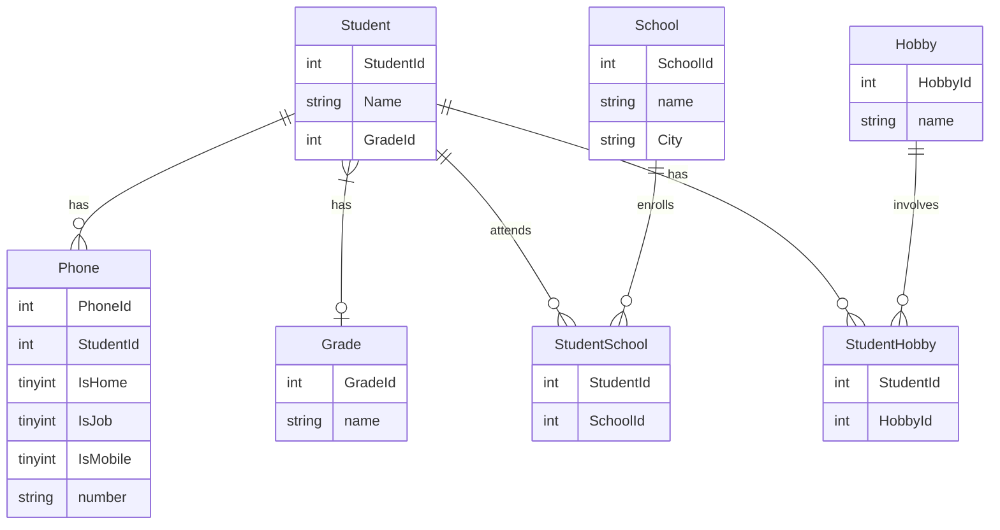

# edu-intro-mysql

## Beskrivning 

> Sista benet, vi avslutar normaliseringen genom att normalsiera betyg.

> Varje elev har exakt ett betyg, eller inget. Varje betyg har många elever.
 


## Analys

```sql
/* Vårt första smutsiga data */
SELECT DISTINCT Grade FROM UNF;
```

## Instruktioner

```sql
DROP TABLE IF EXISTS Grade;
CREATE TABLE Grade (
    GradeId INT NOT NULL AUTO_INCREMENT,
    Name VARCHAR(255) NOT NULL,
    CONSTRAINT PRIMARY KEY (GradeId)
)  ENGINE=INNODB;

INSERT INTO Grade(Name) 
SELECT DISTINCT Grade FROM UNF;

ALTER TABLE Student ADD COLUMN GradeId INT NOT NULL;

/* Ofta kan komplicerade join i en update leda till att resultatet av join får skrivskydd */
/* Så just sådana här UPDATE satser kan kräva mycket slit */
UPDATE Student JOIN UNF ON (StudentID = Id) JOIN Grade ON Grade.Name = UNF.Grade SET  Student.GradeId =  Grade.GradeId;

/* Tänk på hur många rader du vill ha i resultatet, hitta tabellen med så många rader, lägg till nya tabeller med LEFT JOIN hela tiden, och du kommer att sluta med rätt antal rader */

/* GRUND TABELL */
SELECT StudentId as ID  FROM StudentSchool;

/* LEFT JOIN 1 */
SELECT StudentId as ID, Student.Name FROM StudentSchool 
LEFT JOIN Student USING (StudentId);

/* LEFT JOIN 2 */
SELECT StudentId as ID, Student.Name, Grade.Name AS Grade FROM StudentSchool
LEFT JOIN Student USING (StudentId)
LEFT JOIN Grade USING (GradeId);


/* LEFT JOIN 3 */
SELECT StudentId as ID, Student.Name, Grade.Name AS Grade FROM StudentSchool
LEFT JOIN Student USING (StudentId)
LEFT JOIN Grade USING (GradeId);

/* LEFT JOIN 4 */
SELECT StudentId as ID, Student.Name, Grade.Name AS Grade, Hobbies, School.Name AS School, City FROM StudentSchool
LEFT JOIN Student USING (StudentId)
LEFT JOIN Grade USING (GradeId)
LEFT JOIN HobbiesList USING (StudentID)
LEFT JOIN School USING (SchoolId);

/* LEFT JOIN 5 */
SELECT StudentId as ID, Student.Name, Grade.Name AS Grade, Hobbies, School.Name AS School, City, Numbers FROM StudentSchool
LEFT JOIN Student USING (StudentId)
LEFT JOIN Grade USING (GradeId)
LEFT JOIN HobbiesList USING (StudentId)
LEFT JOIN School USING (SchoolId)
LEFT JOIN PhoneList USING (StudentId);


DROP VIEW IF EXISTS AVSLUT;
CREATE VIEW AVSLUT AS
SELECT StudentId as ID, Student.Name, Grade.Name AS Grade, Hobbies, School.Name AS School, City, Numbers FROM StudentSchool
LEFT JOIN Student USING (StudentId)
LEFT JOIN Grade USING (GradeId)
LEFT JOIN HobbiesList USING (StudentId)
LEFT JOIN School USING (SchoolId)
LEFT JOIN PhoneList USING (StudentId);
```
> Cirkeln är sluten. Vi började från en flatfil. Uppenbart tyckte någon att den var användbar. Så vi normaliserade databasen, men vi kan fortfarande komma åt data som liknar flatfilen.

