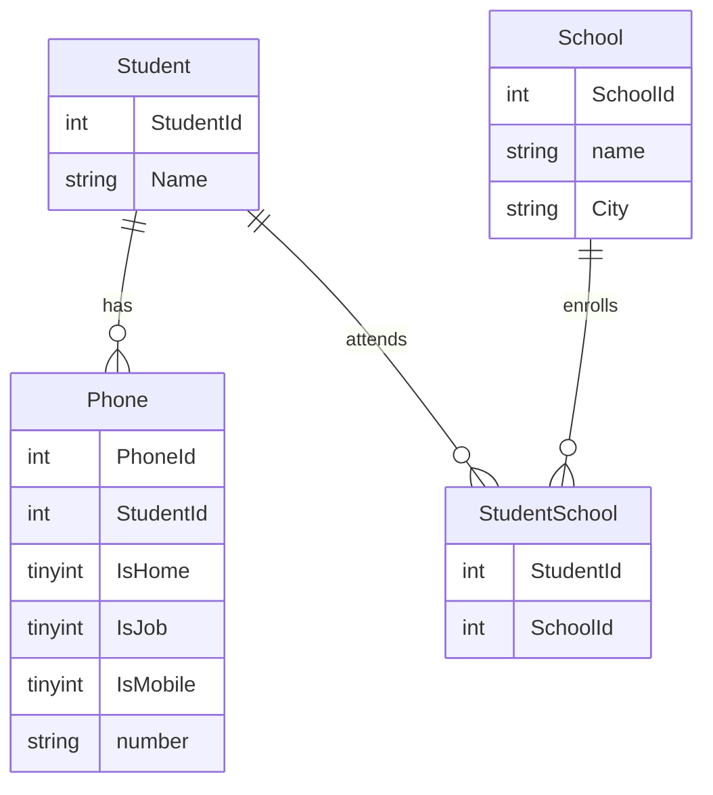

# edu-intro-mysql

## Beskrivning

> Vi Normaliserar School.
> Student School är en så kallad många till många relation. Många till många relationer kräver kopplingstabeller.

> En Elev går i NOLL eller flera skolor, en Skola har NOLL eller flera elever. Genom att använda 0 istället för ett i relationen tillåter vi att vi kan skapa en skola utan elever, och vi kan lägga till en elev, innan han börjat i en skola. Detta kan vara rätt, men kan vara fel också, beroende på vilka regler vi vill ha i vår databas.




## Analysera data

> Det vi kan se är ett så kallat funktionellt beroende. Vi ser att Stad och Skola samvarierar. Dvs stad är funktionellt beroende av skola. Detta bryter mot 2NF.

```sql
SELECT 
Count(DISTINCT Name, City), 
Count(Distinct Name), 
Count(DISTINCT School, City), 
Count(DISTINCT School) 
FROM UNF;
```

## Skapa School

> Vi använder CREATE TABLE AS SELECT ... för att skapa tabellen, då behöver vi inte veta hur den ser ut, utan select satsen bestämmer namn och datatyper. 

```sql
DROP TABLE IF EXISTS School;
CREATE TABLE School AS SELECT DISTINCT 0 As SchoolId, School As Name, City FROM UNF;

SET @id = 0;
UPDATE School SET SchoolId =  (SELECT @id := @id + 1);

ALTER TABLE School ADD PRIMARY KEY(SchoolId);
ALTER TABLE School MODIFY COLUMN SchoolId Int AUTO_INCREMENT;
```

## Skapa kopplingstabell


> Vi använder CREATE TABLE AS SELECT ... för att skapa tabellen, då behöver vi inte veta hur den ser ut, utan select satsen bestämmer namn och datatyper. 

```sql
CREATE TABLE StudentSchool AS SELECT DISTINCT UNF.Id AS StudentId, School.SchoolId
FROM UNF INNER JOIN School ON UNF.School = School.Name;

/* Vi putsar lite */
ALTER TABLE StudentSchool MODIFY COLUMN StudentId INT;
ALTER TABLE StudentSchool MODIFY COLUMN SchoolId INT;
ALTER TABLE StudentSchool ADD PRIMARY KEY(StudentId, SchoolId);

SELECT StudentId, FirstName, LastName FROM Student
JOIN StudentSchool USING (StudentId);

CREATE VIEW SchoolList AS
SELECT StudentId, FirstName, LastName, Name, City FROM Student
JOIN StudentSchool USING (StudentId) 
JOIN School USING (SchoolId);

/* Kolla att vi är tillbaka till 42 rader, dvs dubletter som uppstår för att tre elever går på två skolor*/
SELECT count(*) FROM SchoolList;
```

## Normalisering

> Normalisering innebär att man tar bort anomalier. En anomali är en "konstighet", eller ett felaktigt beteende för databasen. 
> Dessa är hot mot C från ACID (Consistency), dvs motsatsen till korrupt. Så vi skyddar vår data genom att ge den bättre förutsättningar att vara konsistent över åren, genom att ta bort anomalier i databasen. 
> 
> När anomalier är helt borta, är även redundant data borta.
> Vi siktar på tredje Normal Form ([3NF](https://en.wikipedia.org/wiki/Third_normal_form)). Ofta anser man att Boyce-Codd [BCNF](https://en.wikipedia.org/wiki/Boyce%E2%80%93Codd_normal_form) räcker för att en databas ska vara tillräckligt normaliserad. 

### [1NF]()

> En relation är i första normal form, om och endst om, ingen attribut har relationer som element. Exempelvis Hobbies, Telefonnummer, Skola är exempel på relationer som finns i UNF tabellen.

### [2NF](https://en.wikipedia.org/wiki/Second_normal_form)

> Skall vara i 1NF och ...  
> den ska inte ha någon "non-prime" attribute (som staden stockholm), som är funktionellt beroende av en "kandidatnyckel", typ Skola
> Ett "non-prime" attribut av en relation är ett attribute som inte är del av någon kandidat nyckel av relationen. (Dvs Stad)
> Primärnyckeln är den nyckel som identifierar raden. Däremot finns ofta kandidater. Vi skulle mycket väl kunna använda telefonnummer som primär nyckel, så det är en kandidatnyckel. 

### [3NF](https://en.wikipedia.org/wiki/Third_normal_form)

> Varje värde i databasen skall vara beroende enbart av primärnyckeln.

### [4NF](https://en.wikipedia.org/wiki/Fourth_normal_form)

### [5NF](https://en.wikipedia.org/wiki/Fifth_normal_form)

### [BCNF/3.5NF](https://en.wikipedia.org/wiki/Boyce%E2%80%93Codd_normal_form)

> Ett tillägg, då Boyce och Codd insåg att 3NF inte tog bort alla anomalier, så de skapade 3.5NF.

> **_NOTE:_**  BCNF är den normalform som oftast är mål vid databas design.
